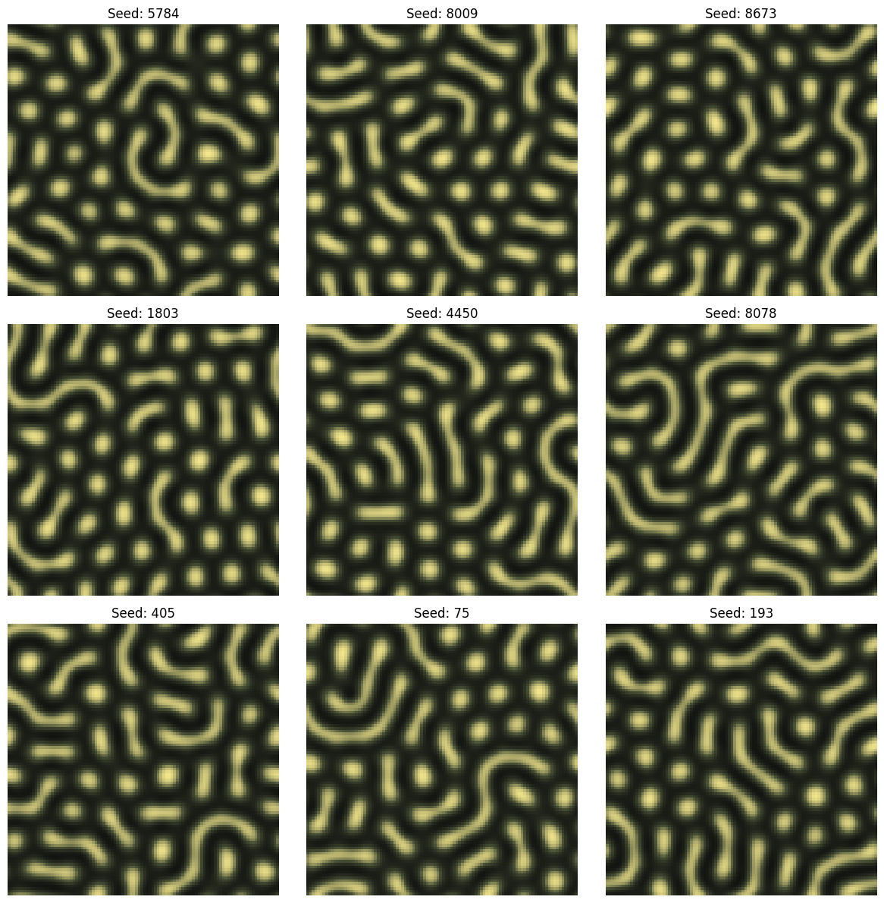

# kamechan_pattern 🐢  
愛亀「かめちゃん（クサガメ）」の頬の模様をイメージしたパターンを、**Gray–Scott 反応拡散モデル**で生成するミニプロジェクトです。

- FFT + IMEX（拡散は陰、反応は陽）で高速に時間発展  
- クサガメっぽい配色の **kusagame colormap** を同梱
 

---

## かめちゃんのご紹介🐢 (クサガメ, メス, 可愛い)


---

## 仕組み（Gray–Scott 反応拡散）

2成分 \,U, V\, の反応拡散方程式を離散化して解きます:

```math
\frac{\partial U}{\partial t} = D_u \nabla^2 U - UV^2 + F(1-U),\quad
\frac{\partial V}{\partial t} = D_v \nabla^2 V + UV^2 - (F+k)V
```
　
- **初期条件**: ランダムなパッチ（U↓/V↑）とノイズを散布  
- **時間積分**: IMEX  
  - 反応項は **陽的（Explicit）**
  - 拡散項はフーリエ空間で **陰的（Implicit）** に解く（離散ラプラシアンの固有値で割る）

---

## 必要環境

- Python 3.9+（推奨 3.10+）
- numpy
- matplotlib

```bash
pip install -U numpy matplotlib
````

---

## 実行方法（Quickstart）

```bash
python3 kamechan_pattern.py
```

デフォルトでは **3×3 のギャラリー**を表示します（seed は master_seed から生成）。

---

## 出力例（ターミナル）

```text
1枚目を計算中... (Seed: 5784)🐢
2枚目を計算中... (Seed: 8009)🐢
3枚目を計算中... (Seed: 8673)🐢
4枚目を計算中... (Seed: 1803)🐢
5枚目を計算中... (Seed: 4450)🐢
6枚目を計算中... (Seed: 8078)🐢
7枚目を計算中... (Seed: 405)🐢
8枚目を計算中... (Seed: 75)🐢
9枚目を計算中... (Seed: 193)🐢
完成しました！🐢
```
## 生成例



---

## パラメータ調整（柄のチューニング）

### 1) 反応拡散パラメータ（`GrayScottParams`）

* `Du`, `Dv`: 拡散係数（大きいほどぼける）
* `F`: feed（供給）
* `k`: kill（除去）

一般に **(F, k)** の組で縞/斑点の相が大きく変わります。
（例）縞寄り・斑点寄りなどはこの2つが支配的になりがちです。

### 2) 初期化（`InitParams`）

* `N`: グリッドサイズ
* `patches`, `patch_size`: パッチ数・サイズ
* `patch_U`, `patch_V`: パッチ内の U/V 値
* `noise`: 初期ノイズ強度

### 3) 数値計算（`dt`, `total_time`）

* `dt` を大きくすると速いですが、荒くなったり発散しやすくなります
* `FloatingPointError: Numerical blow-up detected` が出たら
  **まず `dt` を小さく**してください（例: 5.0 → 2.0 → 1.0）

---

## ファイル構成

* `kamechan_pattern.py` : 生成コード（Gray–Scott + FFT/IMEX）
* `kamechan.JPG` : かめちゃん写真
* `example.png` : 生成例

---

## メモ
* この実装は「速くて気軽」寄りの設定です（精密な PDE 解析というより、模様生成を楽しむ用途）

